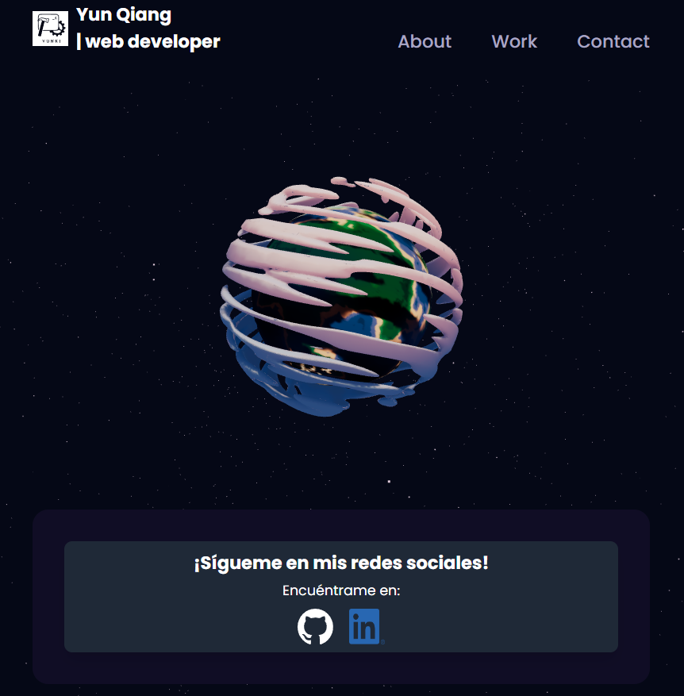

# Portafolio 3D

## Este proyecto es un portafolio personal que se está construyendo utilizando React, así como tecnologías de renderizado 3D como react-three/drei y Fiber. Además, se están utilizando animaciones de Framer Motion para agregar interactividad y mejorar la experiencia de usuario.

## Tecnologías

- React
- Vite
- framer-motion
- react-vertical-timeline-component
- tailwindcss
- Otras tecnologías...

## Instalación

1. Clonar el repositorio

    git clone `https://github.com/yunki-cmd/3d-portafolio.git`

2. Instalar dependencias

    cd nombre-del-repositorio

    npm install

3. Iniciar la aplicación

    npm run dev

    La aplicación se abrirá automáticamente en tu navegador predeterminado en `http://localhost:5173`.